# Matrimony Portal - Comprehensive Technical Report

## Executive Summary

The Matrimony Portal is a full-stack web application built with modern technologies to facilitate matrimonial connections. This report provides detailed technical documentation of the three-tier architecture: Frontend (React), Backend (Spring Boot), and Database (MySQL).


*Figure 1: Application Homepage - Clean and welcoming interface*

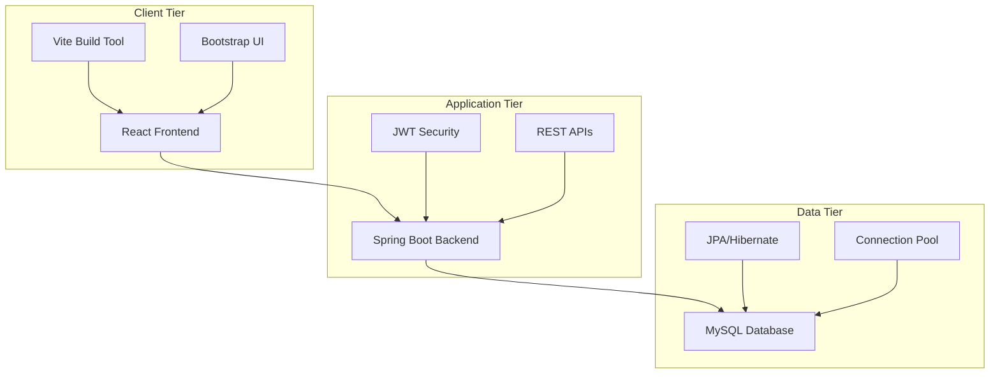
*Figure 2: Three-Tier Architecture Overview*

---

# 1. FRONTEND ARCHITECTURE

## Technology Stack & Architecture

### Core Technologies
- **Framework**: React 19 with modern hooks and functional components
- **Build Tool**: Vite for fast development and optimized production builds
- **Styling**: Bootstrap 5 with custom CSS variables and responsive design
- **Routing**: React Router 7 for client-side navigation
- **State Management**: React Context API with custom hooks
- **Form Handling**: Formik with Yup validation schemas
- **HTTP Client**: Axios with interceptors for API communication
- **Notifications**: React Toastify for user feedback

### Architecture Pattern
The frontend follows a **Component-Based Architecture** with **Separation of Concerns**:

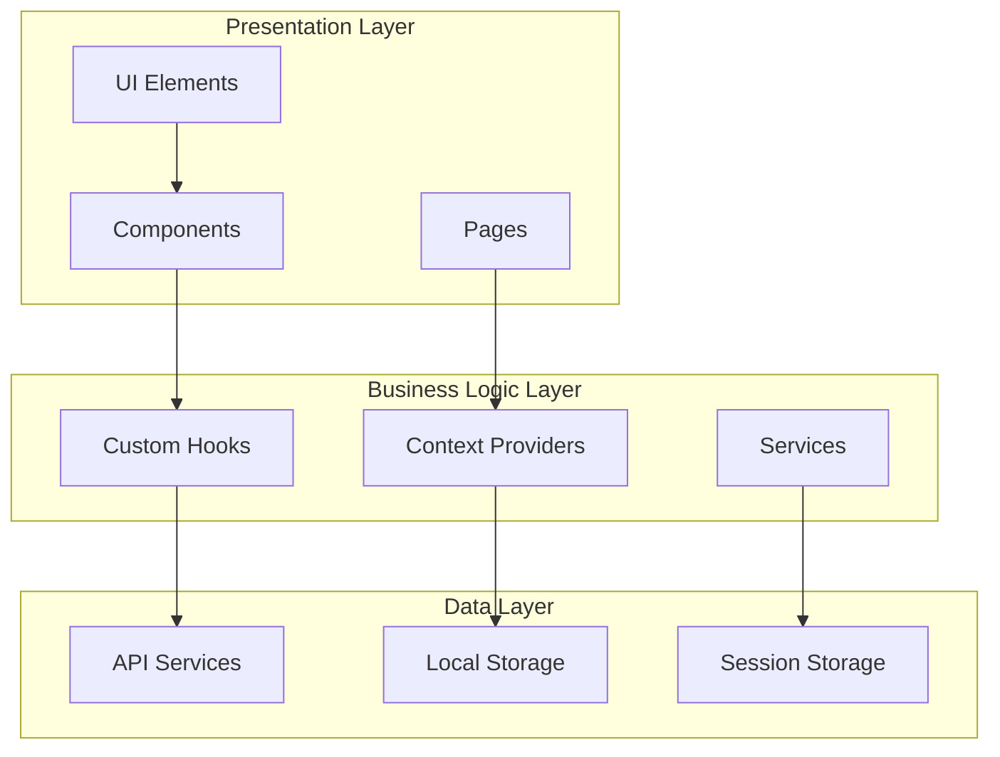
*Figure 3: Frontend Architecture Layers*

## Project Structure

```
src/
├── components/              # Reusable React components
│   ├── auth/               # Authentication components
│   │   ├── Login.jsx
│   │   ├── Register.jsx
│   │   └── ForgotPassword.jsx
│   ├── common/             # Shared UI components
│   │   ├── Header.jsx
│   │   ├── Footer.jsx
│   │   └── Navigation.jsx
│   ├── dashboard/          # Dashboard-specific components
│   │   ├── UserDashboard.jsx
│   │   ├── AdminDashboard.jsx
│   │   └── OrganizerDashboard.jsx
│   ├── ui/                 # Pure UI components
│   │   ├── Button.jsx
│   │   ├── Modal.jsx
│   │   └── Card.jsx
│   └── upgrade/            # Premium features
├── hooks/                  # Custom React hooks
│   ├── useAuth.jsx         # Authentication logic
│   ├── useApi.js           # API interaction
│   ├── useLocalStorage.jsx # Browser storage
│   └── useResponseHandler.js # API response handling
├── services/               # API service layer
│   ├── authService.js      # Authentication APIs
│   ├── userService.js      # User management
│   ├── eventService.js     # Event operations
│   └── proposalService.js  # Proposal handling
├── context/                # React Context definitions
│   └── AuthContext.jsx     # Global auth state
├── providers/              # Context providers
│   └── AuthProvider.jsx    # Auth state provider
├── utils/                  # Utility functions
│   ├── validation.js       # Form validation helpers
│   ├── apiDelay.js        # Development utilities
│   └── responseStructure.js # API response formatting
└── styles/                 # CSS stylesheets
    ├── custom.css          # Global styles
    ├── Login.css           # Component-specific styles
    └── admin.css           # Role-specific styles
```

## Key Frontend Features

### 1. Authentication System


*Figure 4: Login Interface - Secure authentication with form validation*


*Figure 5: Registration Initiation - Step-by-step onboarding process*

**Implementation Details:**
- **JWT Token Management**: Automatic refresh and secure storage
- **Protected Routes**: Route guards preventing unauthorized access
- **Role-based Navigation**: Dynamic UI based on user roles
- **Session Persistence**: Maintains login state across browser sessions

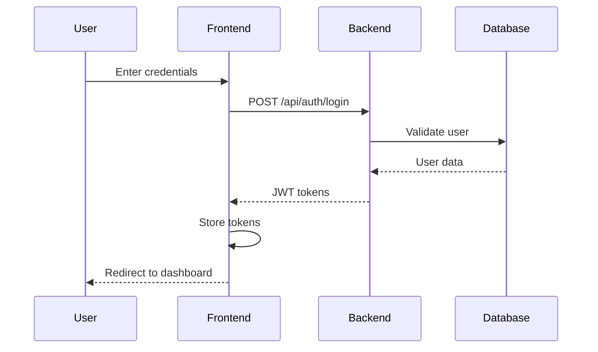
*Figure 6: Authentication Flow Sequence*

### 2. Profile Management System


*Figure 7: Profile Management - Comprehensive profile editing interface*


*Figure 8: Photo Upload - Profile picture management with preview*


*Figure 9: Profile Creation - Detailed information collection form*

**Features:**
- **Multi-step Forms**: Progressive profile completion
- **Real-time Validation**: Instant feedback on form inputs
- **Image Upload**: Profile photo management with preview
- **Privacy Controls**: Granular visibility settings

### 3. Dashboard System


*Figure 10: User Dashboard - Comprehensive activity overview*

**Dashboard Components:**
- **Activity Summary**: Recent matches, interests, and messages
- **Quick Actions**: Fast access to common features
- **Statistics**: Profile views, interest counts, match statistics
- **Notifications**: Real-time updates and alerts

### 4. Matching & Discovery


*Figure 11: Match Discovery - Advanced search with filtering options*


*Figure 12: Profile Viewing - Detailed profile information display*

**Matching Features:**
- **Advanced Filters**: Age, location, religion, education filters
- **Smart Recommendations**: Algorithm-based suggestions
- **Profile Cards**: Intuitive swipe-like interface
- **Detailed Views**: Comprehensive profile information

### 5. Interest Management


*Figure 13: Interest Management - Sent and received proposals tracking*


*Figure 14: Shortlisted Profiles - Favorite profiles management*

### 6. Communication & Settings


*Figure 15: Messaging System - Communication interface*


*Figure 16: User Settings - Account and privacy controls*

### 7. Event Management


*Figure 17: Event Management - Matrimonial events and gatherings*

## Frontend Development Workflow

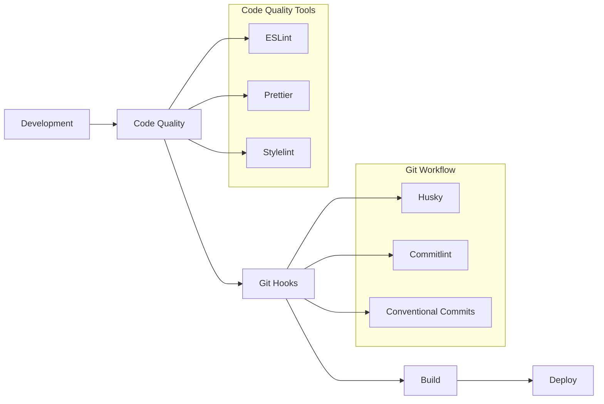
*Figure 18: Frontend Development Pipeline*

### Code Quality Standards
- **ESLint**: JavaScript/React linting with custom rules
- **Prettier**: Consistent code formatting
- **Stylelint**: CSS/SCSS linting and formatting
- **Husky**: Git hooks for pre-commit validation
- **Commitlint**: Conventional commit message enforcement

### Build & Optimization
- **Vite Build**: Fast development server with HMR
- **Code Splitting**: Route-based lazy loading
- **Bundle Analysis**: Optimization for production builds
- **Asset Optimization**: Image compression and lazy loading

---

# 2. BACKEND ARCHITECTURE

## Technology Stack & Architecture

### Core Technologies
- **Framework**: Spring Boot 4.0.2 with embedded Tomcat
- **Language**: Java 17 with modern language features
- **Database**: MySQL 8.0 with JPA/Hibernate ORM
- **Security**: Spring Security with JWT authentication
- **Documentation**: OpenAPI 3.0 with Swagger UI
- **Build Tool**: Maven for dependency management
- **Additional**: Lombok, ModelMapper, FreeMarker, JavaMail

### Architecture Pattern
The backend follows **Domain-Driven Design (DDD)** with **Clean Architecture** principles:

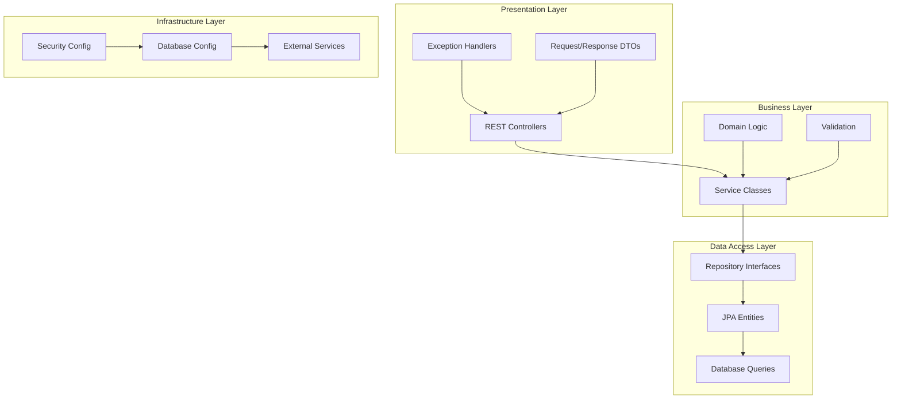
*Figure 19: Backend Architecture Layers*

## Project Structure

```
src/main/java/com/scriptbliss/bandhan/
├── auth/                    # Authentication domain
│   ├── controller/          # REST endpoints
│   │   └── AuthController.java
│   ├── service/            # Business logic
│   │   ├── AuthService.java
│   │   └── JwtService.java
│   ├── repository/         # Data access
│   │   └── UserRepository.java
│   ├── entity/             # JPA entities
│   │   └── User.java
│   └── dto/                # Data transfer objects
│       ├── LoginRequest.java
│       └── AuthResponse.java
├── profile/                # Profile management domain
│   ├── controller/
│   │   └── ProfileController.java
│   ├── service/
│   │   └── ProfileService.java
│   ├── repository/
│   │   └── ProfileRepository.java
│   ├── entity/
│   │   └── Profile.java
│   └── dto/
├── match/                  # Matchmaking domain
│   ├── controller/
│   │   └── MatchController.java
│   ├── service/
│   │   └── MatchService.java
│   ├── repository/
│   │   └── MatchRepository.java
│   ├── entity/
│   │   └── Match.java
│   └── dto/
├── interest/               # Interest management domain
│   ├── controller/
│   │   └── InterestController.java
│   ├── service/
│   │   └── InterestService.java
│   ├── repository/
│   │   └── InterestRepository.java
│   ├── entity/
│   │   └── Interest.java
│   └── dto/
└── shared/                 # Shared components
    ├── config/             # Configuration classes
    │   ├── SecurityConfig.java
    │   ├── DatabaseConfig.java
    │   └── DataLoader.java
    ├── exception/          # Global exception handling
    │   ├── GlobalExceptionHandler.java
    │   ├── BusinessException.java
    │   └── ResourceNotFoundException.java
    ├── dto/                # Common DTOs
    │   └── ApiResponse.java
    └── entity/             # Base entities
        └── BaseEntity.java
```

## Domain Architecture Details

### 1. Authentication Domain

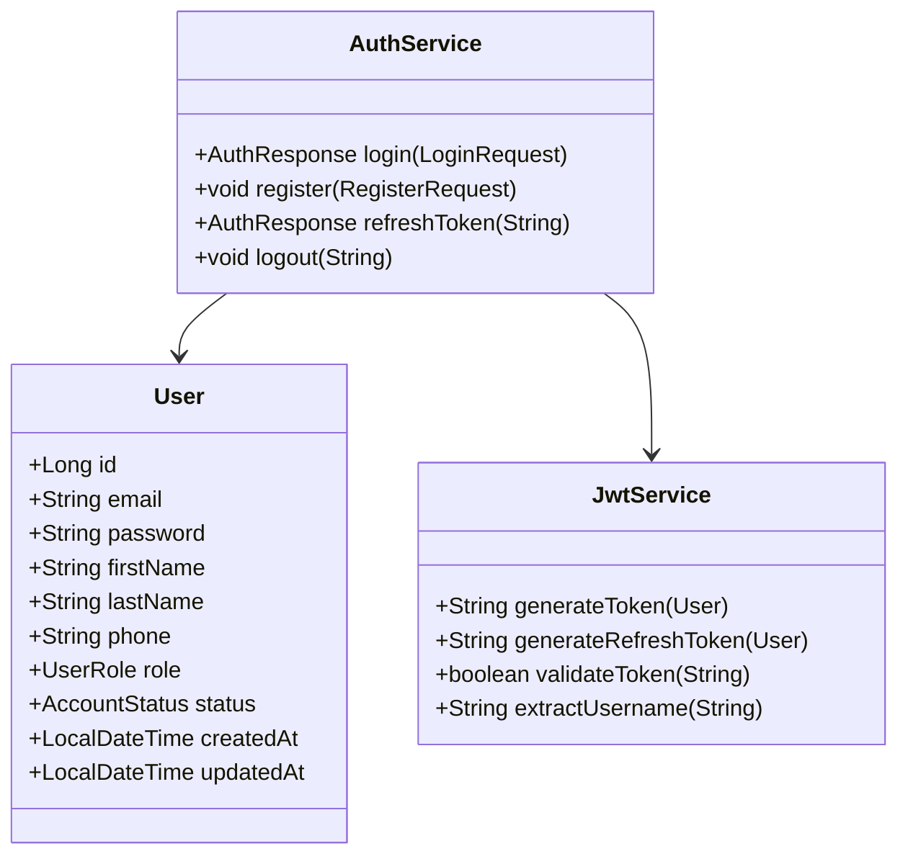
*Figure 20: Authentication Domain Class Diagram*

**Key Features:**
- **JWT Authentication**: Stateless token-based security
- **Role-based Authorization**: USER, ADMIN, EVENT_ORGANIZER roles
- **Password Security**: BCrypt encryption with salt
- **Token Management**: Access and refresh token handling

### 2. Profile Management Domain

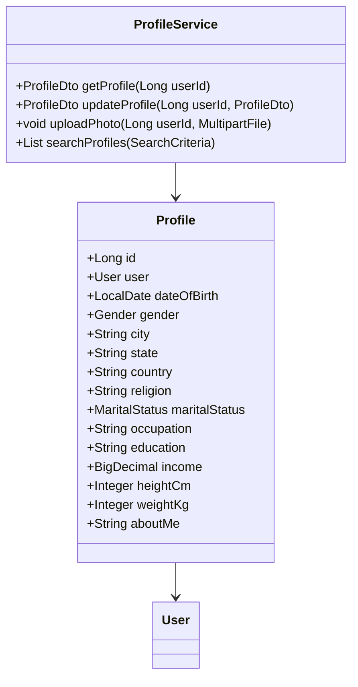
*Figure 21: Profile Domain Class Diagram*

### 3. Matching Algorithm Domain

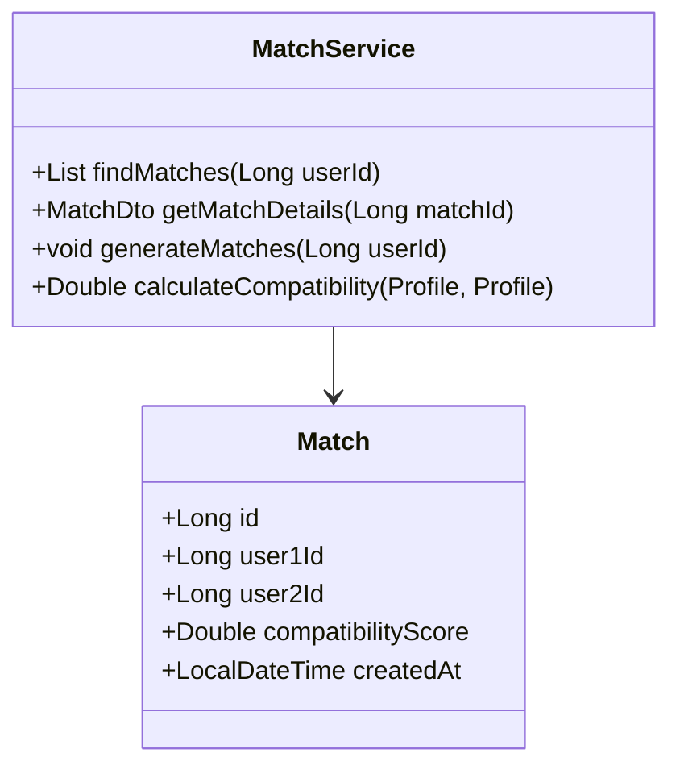
*Figure 22: Match Domain Class Diagram*

**Compatibility Algorithm:**
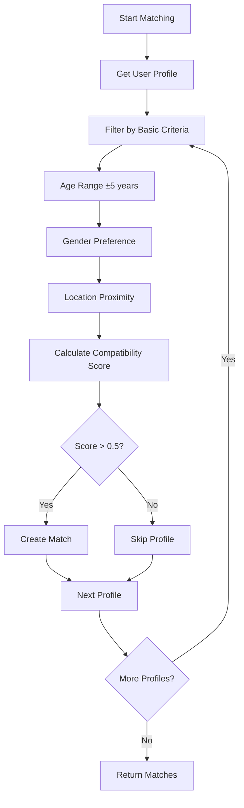
*Figure 23: Matching Algorithm Flow*

### 4. Interest Management Domain

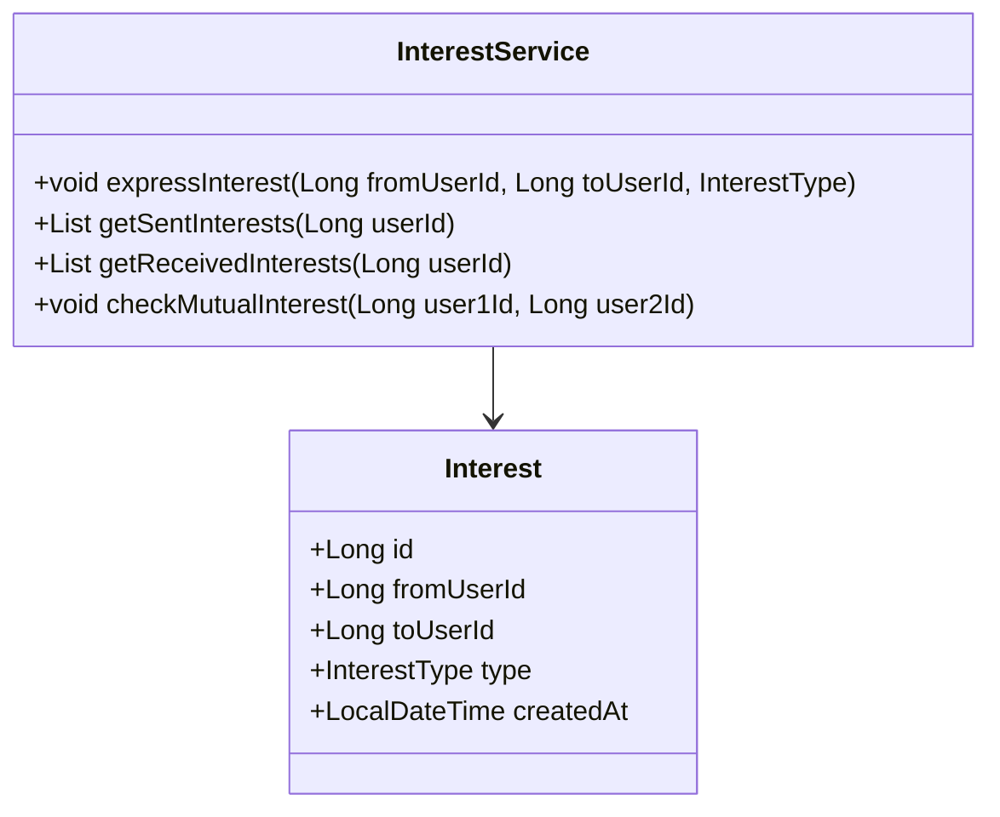
*Figure 24: Interest Domain Class Diagram*

## API Architecture

### RESTful API Design

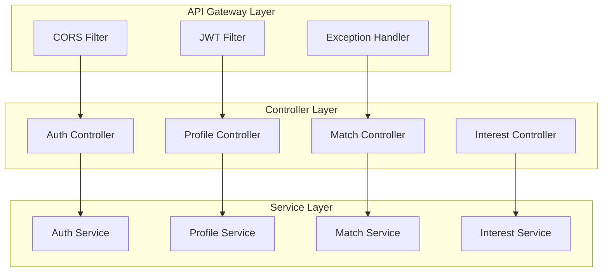
*Figure 25: API Layer Architecture*

### API Endpoints Overview

| Domain | Endpoint | Method | Description |
|--------|----------|--------|--------------|
| Auth | `/api/auth/register` | POST | User registration |
| Auth | `/api/auth/login` | POST | User authentication |
| Auth | `/api/auth/refresh` | POST | Token refresh |
| Profile | `/api/profiles/me` | GET | Get current user profile |
| Profile | `/api/profiles/me` | PUT | Update profile |
| Profile | `/api/profiles/photo` | POST | Upload profile photo |
| Match | `/api/matches` | GET | Get potential matches |
| Match | `/api/matches/generate` | POST | Generate new matches |
| Interest | `/api/interests` | POST | Express interest |
| Interest | `/api/interests/sent` | GET | Get sent interests |

### Security Implementation

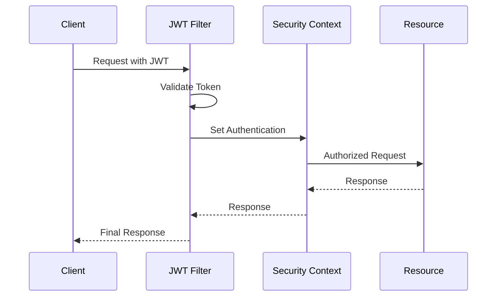
*Figure 26: Security Filter Chain*

**Security Features:**
- **JWT Authentication**: Stateless token validation
- **Role-based Authorization**: Method-level security
- **CORS Configuration**: Cross-origin request handling
- **Input Validation**: Request payload validation
- **Exception Handling**: Secure error responses

## Backend Performance & Scalability

### Database Optimization
- **Connection Pooling**: HikariCP for efficient connections
- **Query Optimization**: JPA query optimization and indexing
- **Lazy Loading**: Efficient entity relationship loading
- **Caching Strategy**: Application-level caching for frequent queries

### Monitoring & Observability
- **Spring Actuator**: Health checks and metrics
- **Logging**: Structured logging with SLF4J
- **Error Tracking**: Comprehensive exception handling
- **Performance Metrics**: Response time and throughput monitoring

## Admin Interface Features

### 1. Admin Dashboard


*Figure 27: Admin Dashboard - Comprehensive administrative control panel*

**Admin Dashboard Features:**
- **User Statistics**: Total users, active profiles, match statistics
- **System Health**: Application performance metrics
- **Recent Activities**: User registrations, profile updates, matches
- **Quick Actions**: User management, content moderation

### 2. User Reports Management


*Figure 28: User Reports Management - Handle user complaints and reports*

**Report Management Features:**
- **Report Categories**: Inappropriate content, fake profiles, harassment
- **Investigation Tools**: User activity tracking, evidence collection
- **Action Management**: Warning, suspension, account termination
- **Resolution Tracking**: Report status and outcome documentation

### 3. Event Management System


*Figure 29: Add New Event - Create and manage matrimonial events*

**Event Management Features:**
- **Event Creation**: Detailed event information and scheduling
- **Venue Management**: Location details and capacity planning
- **Registration Control**: Participant limits and approval process
- **Event Analytics**: Attendance tracking and success metrics

### 4. Communication Management


*Figure 30: Broadcast Message - Send notifications to users*


*Figure 31: Global Announcements - System-wide announcements*

**Communication Features:**
- **Targeted Messaging**: Send messages to specific user groups
- **Announcement System**: Global notifications and updates
- **Template Management**: Pre-defined message templates
- **Delivery Tracking**: Message status and read receipts

---

# 3. DATABASE ARCHITECTURE

## Database Design & Schema

### Technology Stack
- **Database**: MySQL 8.0 with InnoDB storage engine
- **ORM**: JPA/Hibernate for object-relational mapping
- **Connection Pool**: HikariCP for connection management
- **Migration**: Hibernate DDL auto-generation
- **Indexing**: Strategic indexing for query optimization

### Entity Relationship Diagram

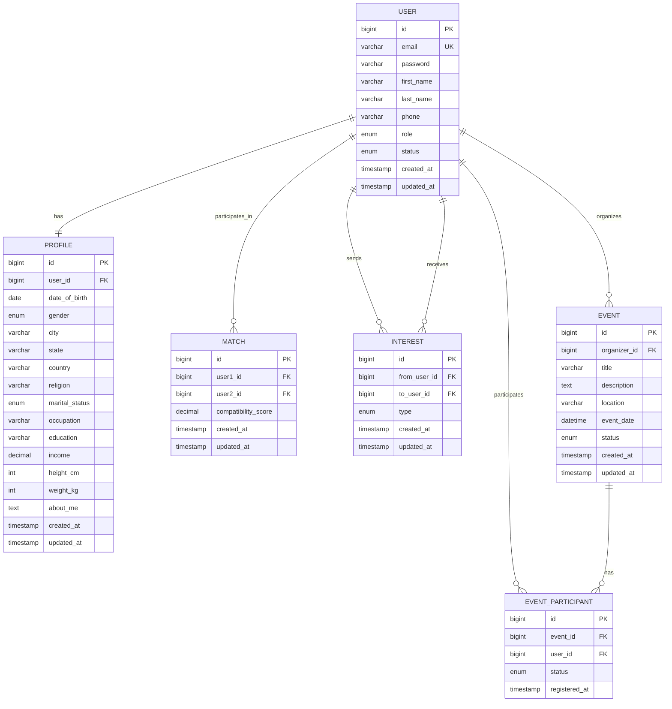
*Figure 26: Complete Entity Relationship Diagram*

## Database Schema Details

### 1. User Management Tables

#### Users Table
```sql
CREATE TABLE users (
    id BIGINT PRIMARY KEY AUTO_INCREMENT,
    email VARCHAR(255) UNIQUE NOT NULL,
    password VARCHAR(255) NOT NULL,
    first_name VARCHAR(100) NOT NULL,
    last_name VARCHAR(100) NOT NULL,
    phone VARCHAR(20),
    role ENUM('USER', 'ADMIN', 'EVENT_ORGANIZER') DEFAULT 'USER',
    status ENUM('ACTIVE', 'INACTIVE', 'SUSPENDED') DEFAULT 'ACTIVE',
    created_at TIMESTAMP DEFAULT CURRENT_TIMESTAMP,
    updated_at TIMESTAMP DEFAULT CURRENT_TIMESTAMP ON UPDATE CURRENT_TIMESTAMP,
    
    INDEX idx_email (email),
    INDEX idx_status (status),
    INDEX idx_role (role)
);
```

#### Profiles Table
```sql
CREATE TABLE profiles (
    id BIGINT PRIMARY KEY AUTO_INCREMENT,
    user_id BIGINT UNIQUE NOT NULL,
    date_of_birth DATE,
    gender ENUM('MALE', 'FEMALE', 'OTHER'),
    city VARCHAR(100),
    state VARCHAR(100),
    country VARCHAR(100) DEFAULT 'India',
    religion VARCHAR(50),
    marital_status ENUM('SINGLE', 'DIVORCED', 'WIDOWED'),
    occupation VARCHAR(100),
    education VARCHAR(100),
    income DECIMAL(10,2),
    height_cm INT,
    weight_kg INT,
    about_me TEXT,
    created_at TIMESTAMP DEFAULT CURRENT_TIMESTAMP,
    updated_at TIMESTAMP DEFAULT CURRENT_TIMESTAMP ON UPDATE CURRENT_TIMESTAMP,
    
    FOREIGN KEY (user_id) REFERENCES users(id) ON DELETE CASCADE,
    INDEX idx_gender (gender),
    INDEX idx_city (city),
    INDEX idx_religion (religion),
    INDEX idx_age (date_of_birth),
    INDEX idx_location (city, state)
);
```

### 2. Matching System Tables

#### Matches Table
```sql
CREATE TABLE matches (
    id BIGINT PRIMARY KEY AUTO_INCREMENT,
    user1_id BIGINT NOT NULL,
    user2_id BIGINT NOT NULL,
    compatibility_score DECIMAL(3,2) NOT NULL,
    created_at TIMESTAMP DEFAULT CURRENT_TIMESTAMP,
    updated_at TIMESTAMP DEFAULT CURRENT_TIMESTAMP ON UPDATE CURRENT_TIMESTAMP,
    
    FOREIGN KEY (user1_id) REFERENCES users(id) ON DELETE CASCADE,
    FOREIGN KEY (user2_id) REFERENCES users(id) ON DELETE CASCADE,
    UNIQUE KEY unique_match (user1_id, user2_id),
    INDEX idx_user1 (user1_id),
    INDEX idx_user2 (user2_id),
    INDEX idx_score (compatibility_score)
);
```

#### Interests Table
```sql
CREATE TABLE interests (
    id BIGINT PRIMARY KEY AUTO_INCREMENT,
    from_user_id BIGINT NOT NULL,
    to_user_id BIGINT NOT NULL,
    type ENUM('LIKE', 'PASS') NOT NULL,
    created_at TIMESTAMP DEFAULT CURRENT_TIMESTAMP,
    updated_at TIMESTAMP DEFAULT CURRENT_TIMESTAMP ON UPDATE CURRENT_TIMESTAMP,
    
    FOREIGN KEY (from_user_id) REFERENCES users(id) ON DELETE CASCADE,
    FOREIGN KEY (to_user_id) REFERENCES users(id) ON DELETE CASCADE,
    UNIQUE KEY unique_interest (from_user_id, to_user_id),
    INDEX idx_from_user (from_user_id),
    INDEX idx_to_user (to_user_id),
    INDEX idx_type (type)
);
```

### 3. Event Management Tables

#### Events Table
```sql
CREATE TABLE events (
    id BIGINT PRIMARY KEY AUTO_INCREMENT,
    organizer_id BIGINT NOT NULL,
    title VARCHAR(200) NOT NULL,
    description TEXT,
    location VARCHAR(200),
    event_date DATETIME NOT NULL,
    status ENUM('DRAFT', 'PUBLISHED', 'CANCELLED', 'COMPLETED') DEFAULT 'DRAFT',
    max_participants INT,
    created_at TIMESTAMP DEFAULT CURRENT_TIMESTAMP,
    updated_at TIMESTAMP DEFAULT CURRENT_TIMESTAMP ON UPDATE CURRENT_TIMESTAMP,
    
    FOREIGN KEY (organizer_id) REFERENCES users(id) ON DELETE CASCADE,
    INDEX idx_organizer (organizer_id),
    INDEX idx_date (event_date),
    INDEX idx_status (status),
    INDEX idx_location (location)
);
```

## Database Performance Optimization

### Indexing Strategy

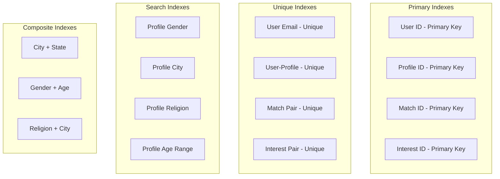
*Figure 32: Database Indexing Strategy*

### Query Optimization

#### Efficient Match Finding Query
```sql
-- Optimized query for finding potential matches
SELECT p2.*, 
       CASE 
           WHEN p1.city = p2.city THEN 0.3
           WHEN p1.state = p2.state THEN 0.1
           ELSE 0
       END +
       CASE 
           WHEN p1.religion = p2.religion THEN 0.4
           ELSE 0
       END +
       CASE 
           WHEN ABS(YEAR(p1.date_of_birth) - YEAR(p2.date_of_birth)) <= 5 THEN 0.3
           ELSE 0
       END as compatibility_score
FROM profiles p1
JOIN profiles p2 ON p1.id != p2.id
WHERE p1.user_id = ?
  AND p2.gender = (
      CASE 
          WHEN p1.gender = 'MALE' THEN 'FEMALE'
          WHEN p1.gender = 'FEMALE' THEN 'MALE'
          ELSE 'OTHER'
      END
  )
  AND ABS(YEAR(p1.date_of_birth) - YEAR(p2.date_of_birth)) <= 10
  AND NOT EXISTS (
      SELECT 1 FROM interests i 
      WHERE i.from_user_id = p1.user_id 
        AND i.to_user_id = p2.user_id
  )
ORDER BY compatibility_score DESC
LIMIT 20;
```

### Connection Pool Configuration

```yaml
# HikariCP Configuration
spring:
  datasource:
    hikari:
      maximum-pool-size: 20
      minimum-idle: 5
      idle-timeout: 300000
      max-lifetime: 1200000
      connection-timeout: 20000
      leak-detection-threshold: 60000
```

## Data Management & Migration

### Test Data Generation

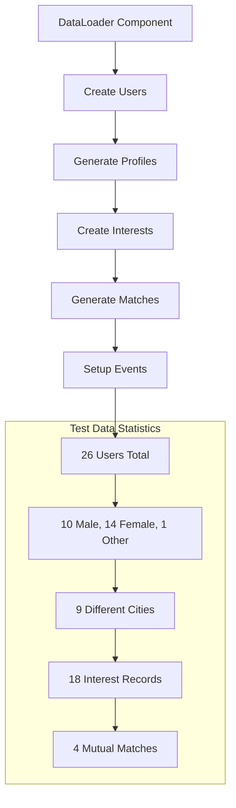
*Figure 33: Test Data Generation Flow*

### Database Backup & Recovery

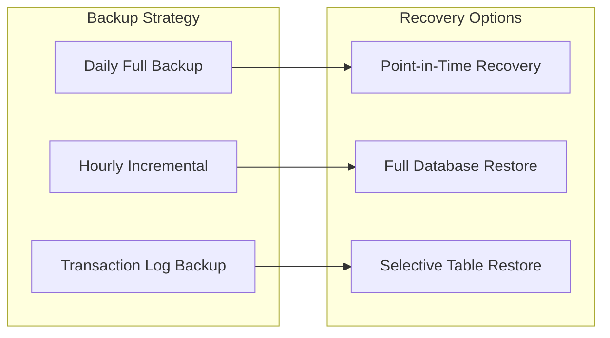
*Figure 34: Backup and Recovery Strategy*

## Database Security

### Security Measures
- **Connection Encryption**: SSL/TLS for data in transit
- **Access Control**: Role-based database access
- **SQL Injection Prevention**: Parameterized queries via JPA
- **Data Encryption**: Sensitive data encryption at rest
- **Audit Logging**: Database operation logging

### Data Privacy Compliance
- **Personal Data Protection**: Secure handling of PII
- **Data Retention Policies**: Automated data cleanup
- **User Consent Management**: Privacy preference tracking
- **Data Export/Deletion**: GDPR compliance features

---

## System Integration & Communication

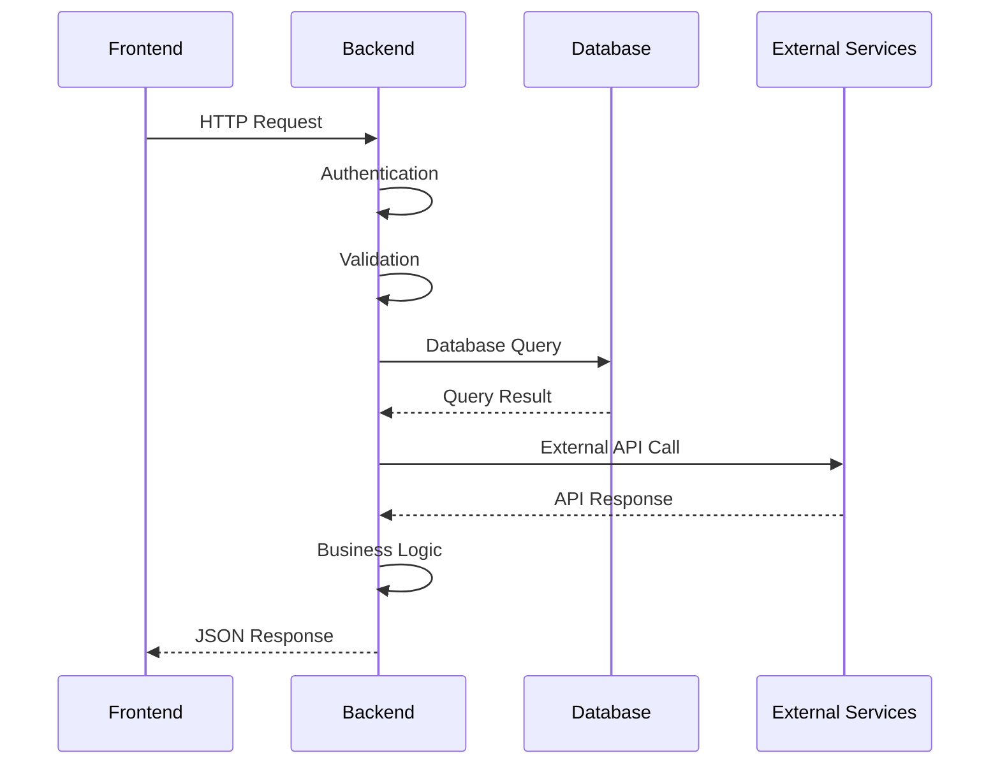
*Figure 35: Complete System Communication Flow*

## Conclusion

This comprehensive technical report demonstrates the robust three-tier architecture of the Matrimony Portal, showcasing modern development practices, scalable design patterns, and security-first implementation across all layers of the application stack.

## Project Overview

### Vision
To create a modern, secure, and efficient matrimonial platform that connects individuals seeking life partners through intelligent matching and comprehensive profile management.

### Key Features
- **User Authentication & Authorization** with JWT tokens
- **Advanced Profile Management** with detailed personal information
- **Intelligent Matching Algorithm** based on compatibility scoring
- **Interest Management System** with likes/passes and mutual matching
- **Multi-role Support** (User, Admin, Event Organizer)
- **Comprehensive Admin Dashboard** for user and content management
- **Event Management System** for matrimonial events
- **Responsive Web Interface** with modern UI/UX


*Figure 2: User Dashboard - Comprehensive overview of user activities*

---

## Backend Architecture

### Technology Stack
- **Framework**: Spring Boot 4.0.2
- **Language**: Java 17
- **Database**: MySQL with JPA/Hibernate
- **Security**: Spring Security with JWT authentication
- **Documentation**: OpenAPI/Swagger 3.0.1
- **Build Tool**: Maven
- **Additional Libraries**: Lombok, ModelMapper, FreeMarker, JavaMail

### Project Structure
```
src/main/java/com/scriptbliss/bandhan/
├── auth/                    # Authentication domain
│   ├── controller/          # REST controllers
│   ├── service/            # Business logic
│   ├── repository/         # Data access layer
│   ├── entity/             # JPA entities
│   └── dto/                # Data transfer objects
├── profile/                # User profile management
├── match/                  # Matchmaking system
├── interest/               # User interest management
├── shared/                 # Common components
│   ├── config/             # Configuration classes
│   ├── exception/          # Global exception handling
│   ├── dto/                # Shared DTOs
│   └── entity/             # Base entities
└── BandhanBackendApplication.java
```

### Domain Architecture

#### 1. Authentication Domain (`auth/`)
- **User Entity**: Core user information with roles and status
- **JWT Security**: Token-based authentication with refresh tokens
- **Role-based Access**: USER, ADMIN, EVENT_ORGANIZER roles
- **Account Management**: Registration, login, password reset

#### 2. Profile Domain (`profile/`)
- **Comprehensive Profiles**: Personal, family, and preference details
- **Photo Management**: Profile picture upload and management
- **Privacy Controls**: Visibility settings for profile information
- **Profile Validation**: Data integrity and completeness checks

#### 3. Match Domain (`match/`)
- **Compatibility Algorithm**: Multi-factor scoring system
- **Match Generation**: Automated compatible partner suggestions
- **Match Filtering**: Age, location, religion-based filtering
- **Match History**: Track and manage match interactions

#### 4. Interest Domain (`interest/`)
- **Like/Pass System**: Express interest or pass on profiles
- **Mutual Matching**: Automatic match creation on mutual likes
- **Interest History**: Track all user interactions
- **Notification System**: Alert users of mutual interests

### Key Backend Features

#### Security Implementation
```java
@Configuration
@EnableWebSecurity
public class SecurityConfig {
    // JWT-based authentication
    // Role-based authorization
    // CORS configuration
    // Password encryption with BCrypt
}
```

#### Global Exception Handling
- **Custom Exceptions**: BusinessException, ResourceNotFoundException, IllegalStateException
- **HTTP Status Mapping**: Proper status codes for different error types
- **Structured Error Responses**: Consistent error format across APIs
- **Validation Error Handling**: Field-level validation messages

#### Data Loading & Testing
- **Comprehensive Test Data**: 26 users across 9 cities
- **Realistic Profiles**: Diverse demographics and preferences
- **Sample Interactions**: Pre-loaded interests and matches
- **Development Environment**: Profile-based data loading

### API Endpoints

#### Authentication APIs
- `POST /api/auth/register` - User registration
- `POST /api/auth/login` - User login
- `POST /api/auth/refresh` - Token refresh
- `POST /api/auth/logout` - User logout


*Figure 3: Login Interface - Secure authentication system*


*Figure 4: Registration Process - Step-by-step user onboarding*

#### Profile APIs
- `GET /api/profiles/me` - Get current user profile
- `PUT /api/profiles/me` - Update profile
- `POST /api/profiles/photo` - Upload profile photo
- `GET /api/profiles/{id}` - Get specific profile


*Figure 5: Profile Management - Comprehensive profile editing*


*Figure 6: Photo Upload - Profile picture management*


*Figure 7: Profile Creation - Detailed information collection*

#### Match APIs
- `GET /api/matches` - Get potential matches
- `GET /api/matches/{id}` - Get specific match details
- `POST /api/matches/generate` - Generate new matches


*Figure 8: Match Discovery - Advanced search and filtering*


*Figure 9: Profile Viewing - Detailed profile information display*

#### Interest APIs
- `POST /api/interests` - Express interest
- `GET /api/interests/sent` - Get sent interests
- `GET /api/interests/received` - Get received interests


*Figure 10: Interest Management - Sent and received proposals*


*Figure 11: Shortlisted Profiles - Favorite profiles management*

---

## Frontend Architecture

### Technology Stack
- **Framework**: React 19
- **Build Tool**: Vite
- **Styling**: Bootstrap 5 + Custom CSS
- **Routing**: React Router 7
- **State Management**: React Context API
- **Form Handling**: Formik + Yup validation
- **HTTP Client**: Axios
- **Notifications**: React Toastify
- **Code Quality**: ESLint, Prettier, Stylelint
- **Git Hooks**: Husky, Commitlint

### Project Structure
```
src/
├── components/              # React components
│   ├── auth/               # Authentication components
│   ├── common/             # Shared components
│   ├── dashboard/          # Dashboard components
│   ├── ui/                 # UI components
│   └── upgrade/            # Upgrade components
├── hooks/                  # Custom React hooks
│   ├── useAuth.jsx         # Authentication hook
│   ├── useApi.js           # API interaction hook
│   └── useLocalStorage.jsx # Local storage hook
├── services/               # API services
│   ├── authService.js      # Authentication APIs
│   ├── userService.js      # User management APIs
│   ├── eventService.js     # Event management APIs
│   └── proposalService.js  # Proposal APIs
├── context/                # React contexts
├── providers/              # Context providers
├── utils/                  # Utility functions
└── styles/                 # CSS stylesheets
```

### Key Frontend Features

#### Authentication System
- **JWT Token Management**: Automatic token refresh and storage
- **Protected Routes**: Route guards for authenticated users
- **Role-based Navigation**: Different interfaces for different user roles
- **Session Management**: Persistent login state

#### User Interface
- **Responsive Design**: Mobile-first approach with Bootstrap
- **Modern UI Components**: Clean, intuitive interface design
- **Form Validation**: Real-time validation with Formik and Yup
- **Loading States**: User feedback during API operations
- **Error Handling**: Graceful error display and recovery


*Figure 13: Messaging System - Communication interface*


*Figure 14: User Settings - Account and privacy controls*

#### Dashboard System
- **Multi-role Dashboards**: Separate interfaces for users, admins, and organizers
- **Profile Management**: Comprehensive profile editing capabilities
- **Match Browsing**: Interactive match discovery interface
- **Interest Management**: Like/pass functionality with visual feedback

### Development Workflow
- **Code Quality**: Automated linting and formatting
- **Git Hooks**: Pre-commit validation and conventional commits
- **Development Server**: Hot reload with Vite
- **Build Optimization**: Production-ready builds with code splitting

---

## Database Design

### Entity Relationship Model

#### Core Entities
1. **User**: Authentication and basic information
2. **Profile**: Detailed user profile information
3. **Match**: Compatibility matches between users
4. **Interest**: User interactions (likes/passes)
5. **Event**: Matrimonial events and gatherings

#### Key Relationships
- User ↔ Profile (One-to-One)
- User ↔ Interest (One-to-Many as sender/receiver)
- User ↔ Match (Many-to-Many through Match entity)
- User ↔ Event (Many-to-Many for event participation)

### Database Schema Highlights
```sql
-- Users table with authentication info
CREATE TABLE users (
    id BIGINT PRIMARY KEY AUTO_INCREMENT,
    email VARCHAR(255) UNIQUE NOT NULL,
    password VARCHAR(255) NOT NULL,
    role ENUM('USER', 'ADMIN', 'EVENT_ORGANIZER'),
    status ENUM('ACTIVE', 'INACTIVE', 'SUSPENDED'),
    created_at TIMESTAMP DEFAULT CURRENT_TIMESTAMP
);

-- Profiles table with detailed information
CREATE TABLE profiles (
    id BIGINT PRIMARY KEY AUTO_INCREMENT,
    user_id BIGINT UNIQUE,
    date_of_birth DATE,
    gender ENUM('MALE', 'FEMALE', 'OTHER'),
    city VARCHAR(100),
    religion VARCHAR(50),
    marital_status ENUM('SINGLE', 'DIVORCED', 'WIDOWED'),
    FOREIGN KEY (user_id) REFERENCES users(id)
);

-- Matches table for compatibility tracking
CREATE TABLE matches (
    id BIGINT PRIMARY KEY AUTO_INCREMENT,
    user1_id BIGINT,
    user2_id BIGINT,
    compatibility_score DECIMAL(3,2),
    created_at TIMESTAMP DEFAULT CURRENT_TIMESTAMP,
    FOREIGN KEY (user1_id) REFERENCES users(id),
    FOREIGN KEY (user2_id) REFERENCES users(id)
);
```

---

## System Features

### 1. User Management
- **Registration Process**: Multi-step registration with validation
- **Profile Creation**: Comprehensive profile building
- **Account Verification**: Email verification system
- **Privacy Controls**: Granular privacy settings

### 2. Matching Algorithm
- **Compatibility Scoring**: Multi-factor algorithm considering:
  - Age compatibility (±5 years preference)
  - Geographic proximity (same city bonus)
  - Religious compatibility
  - Educational background
  - Professional status
- **Smart Filtering**: Automatic filtering based on preferences
- **Match Quality**: Scoring system from 0.0 to 1.0

### 3. Interest Management
- **Like/Pass System**: Simple interaction mechanism
- **Mutual Matching**: Automatic match creation on mutual likes
- **Interest History**: Complete interaction tracking
- **Notification System**: Real-time interest notifications

### 4. Admin Panel
- **User Management**: View, edit, suspend user accounts
- **Content Moderation**: Review and approve profiles
- **Analytics Dashboard**: User statistics and engagement metrics
- **Event Management**: Create and manage matrimonial events

### 5. Event System
- **Event Creation**: Organizers can create matrimonial events
- **Event Registration**: Users can register for events
- **Event Management**: Complete event lifecycle management
- **Participant Tracking**: Monitor event attendance


*Figure 12: Event Management - Matrimonial events and gatherings*

---

## Security Implementation

### Backend Security
- **JWT Authentication**: Stateless token-based authentication
- **Password Encryption**: BCrypt hashing with salt
- **Role-based Authorization**: Method-level security annotations
- **CORS Configuration**: Controlled cross-origin requests
- **Input Validation**: Comprehensive request validation
- **SQL Injection Prevention**: JPA/Hibernate parameterized queries

### Frontend Security
- **Token Management**: Secure token storage and refresh
- **Route Protection**: Authentication guards on protected routes
- **Input Sanitization**: XSS prevention measures
- **HTTPS Enforcement**: Secure communication protocols

---

## Development & Deployment

### Development Environment
- **Backend**: Spring Boot with embedded Tomcat
- **Frontend**: Vite development server with hot reload
- **Database**: MySQL with Docker support
- **API Documentation**: Swagger UI for API testing

### Build & Deployment
- **Backend Build**: Maven for dependency management and packaging
- **Frontend Build**: Vite for optimized production builds
- **Containerization**: Docker support with docker-compose
- **Environment Configuration**: Profile-based configuration management

### Code Quality
- **Backend**: Spring Boot best practices, clean architecture
- **Frontend**: ESLint, Prettier, Stylelint for code consistency
- **Git Workflow**: Conventional commits with Husky hooks
- **Testing**: Comprehensive test coverage (planned)

---

## Performance Considerations

### Backend Optimizations
- **Database Indexing**: Optimized queries with proper indexing
- **Lazy Loading**: JPA lazy loading for related entities
- **Caching Strategy**: Application-level caching for frequent queries
- **Connection Pooling**: Efficient database connection management

### Frontend Optimizations
- **Code Splitting**: Dynamic imports for route-based splitting
- **Bundle Optimization**: Vite's optimized build process
- **Image Optimization**: Compressed images and lazy loading
- **API Caching**: Client-side caching for static data

---

## Testing Strategy

### Backend Testing
- **Unit Tests**: Service layer testing with JUnit
- **Integration Tests**: Repository and controller testing
- **Security Tests**: Authentication and authorization testing
- **API Tests**: Comprehensive endpoint testing

### Frontend Testing
- **Component Tests**: React component testing (planned)
- **Integration Tests**: User flow testing (planned)
- **E2E Tests**: Complete application workflow testing (planned)

---

## Future Enhancements

### Planned Features
1. **Real-time Chat**: WebSocket-based messaging system
2. **Video Calls**: Integrated video calling functionality
3. **Mobile App**: React Native mobile application
4. **AI Matching**: Machine learning-based compatibility prediction
5. **Payment Integration**: Premium membership features
6. **Advanced Search**: Elasticsearch-based search functionality
7. **Social Features**: Timeline, posts, and social interactions
8. **Recommendation Engine**: Personalized match recommendations

### Technical Improvements
1. **Microservices Architecture**: Service decomposition for scalability
2. **Redis Caching**: Distributed caching for performance
3. **Message Queues**: Asynchronous processing with RabbitMQ
4. **Monitoring**: Application performance monitoring
5. **CI/CD Pipeline**: Automated testing and deployment
6. **Load Balancing**: Horizontal scaling capabilities

---

## Conclusion

The Matrimony Portal represents a comprehensive solution for modern matrimonial services, combining robust backend architecture with an intuitive frontend interface. The application successfully implements core matrimonial features including user management, profile creation, intelligent matching, and interest management.

### Key Achievements
- **Scalable Architecture**: Clean, maintainable code structure
- **Security First**: Comprehensive security implementation
- **User Experience**: Intuitive and responsive interface
- **Performance**: Optimized for speed and efficiency
- **Maintainability**: Well-documented and structured codebase

### Technical Excellence
- **Modern Stack**: Latest versions of Spring Boot and React
- **Best Practices**: Industry-standard development practices
- **Code Quality**: Automated quality checks and formatting
- **Documentation**: Comprehensive API documentation with Swagger

The project demonstrates proficiency in full-stack development, system design, and modern web application architecture, making it a solid foundation for a production-ready matrimonial platform.

---

## Appendix

### Development Team
- **Backend Development**: Spring Boot, Java, MySQL
- **Frontend Development**: React, JavaScript, Bootstrap
- **Database Design**: MySQL, JPA/Hibernate
- **DevOps**: Docker, Maven, Vite

### Repository Information
- **Backend Repository**: matrimony-backend
- **Frontend Repository**: matrimony-frontend
- **Documentation**: Comprehensive README files and inline documentation
- **License**: MIT License

### Contact Information
- **Project Lead**: Sachin Kumar (sinha1abc@gmail.com)
- **Organization**: CDAC Sunbeam
- **Project Duration**: [Development Timeline]
- **Version**: 1.0.0-SNAPSHOT